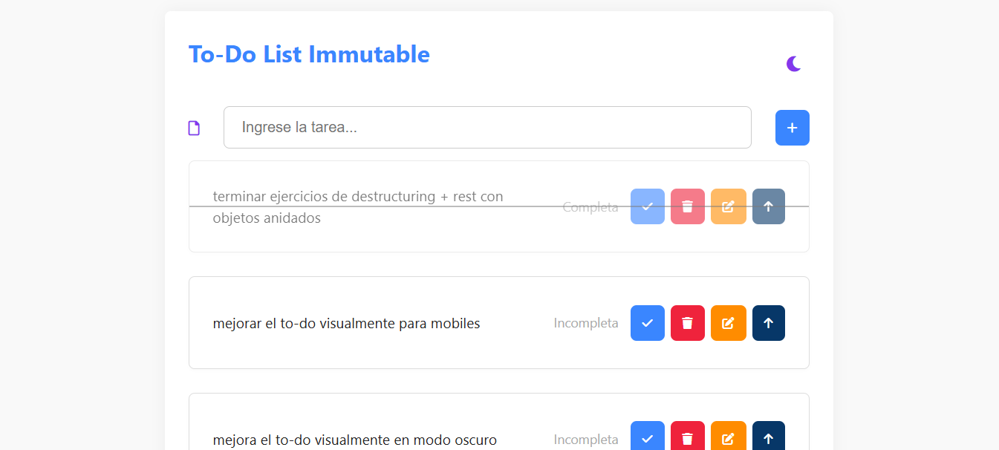

# 📝 Todo List - Edición y Prioridad

Aplicación web interactiva para gestionar tareas con edición en línea, priorización reversible y persistencia local. Desarrollada con enfoque en buenas prácticas, experiencia de usuario y código limpio.

## 🌐 Demo en vivo



👉 [Ver demo en GitHub Pages](https://andresmo23.github.io/todo-list-immutable/)

---

## ⚙️ Funcionalidades

- ✏️ Edición en línea con validación
- 📌 Priorizar y despriorizar tareas de forma reversible
- 🔄 Reordenamiento inteligente por prioridad y fecha
- ✅ Marcar como completadas / eliminar tareas
- 💾 Guardado automático en `localStorage`
- 🎨 Estilos visuales diferenciados e íconos dinámicos
- 🌙 Modo oscuro básico
- 📱 Diseño responsive para desktop y móvil

---

## 🧠 Enfoque técnico

- Código modular (en proceso de mejora)
- Funciones puras y separación por responsabilidades
- Métodos declarativos: `map()`, `sort()`, `filter()`
- Manipulación del DOM con lógica inmutable
- Buenas prácticas: DRY, nombres expresivos, accesibilidad básica

---

## 📦 Instalación local

```bash
git clone https://github.com/andresmo23/todo-list-immutable.git
cd todo-list-immutable
Luego abre index.html en tu navegador.
```

---

## 🛣️ Roadmap

- [ ] Modularizar el código en componentes JS
- [ ] Mejorar estilos en modo oscuro
- [ ] Optimizar diseño responsive para móviles
- [ ] Añadir animaciones sutiles

---

## 🤝 Contribuciones
¡Las contribuciones son bienvenidas! Puedes abrir un Issue, proponer mejoras o enviar un Pull Request siguiendo la guía de estilo del proyecto.

---

## 📄 Licencia
Este proyecto está bajo la licencia MIT

---

## 🧑 Autor
Desarrollado por @andresmo23 como parte de su proceso de aprendizaje y  profesionalización en JavaScript, CSS y arquitectura de proyectos.